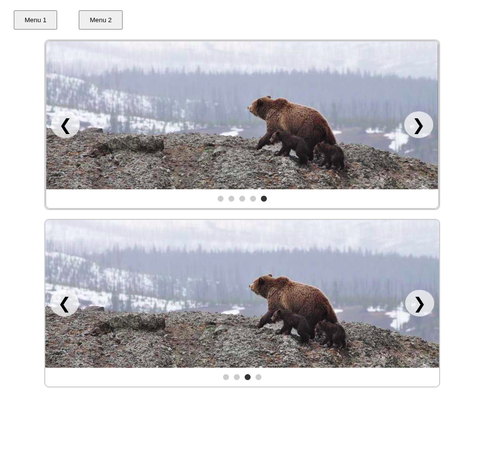

## 📦 `@sarawebs/sb-components`

A lightweight and modular component library from **SaraWebs**, starting with a fully reusable **Dropdown** system and built with flexibility in mind — perfect for client dashboards, internal tools, and modern web apps.

Designed with **composition**, **zero dependencies**, and **real-world use** in mind. More components coming soon 🚀.

---

### ✨ Features

* 🧱 **Composable Architecture**
  Clean, class-based structure using best practices in reusable JavaScript.

* 🔁 **Multiple Instances**
  Easily supports multiple dropdowns per page — all independently controlled.

* 🖱️ **Click or Hover Triggers**
  Choose trigger behavior via `data-trigger` — no code changes required.

* 🧩 **Expandable Design**
  Built as a foundation for future UI components like modals, tabs, toasts, and tooltips.

* ⚙️ **Zero Dependencies**
  Lightweight and bundler-friendly. No need for jQuery or bulky UI libs.

---

### 📚 API Reference

#### Installation

```bash
npm install @sarawebs/sb-components
```

---

### 🧭 Current Component: Dropdown

#### HTML Example

```html
<div class="dropdown" data-trigger="click">
  <button class="dropdown-toggle">Open Menu</button>
  <ul class="dropdown-menu">
    <li><a href="#">Option 1</a></li>
    <li><a href="#">Option 2</a></li>
  </ul>
</div>
```

> You can switch behavior by using `data-trigger="hover"` instead.

---

#### JS Usage

```js
"@sarawebs/sb-components/Dropdown/style"; // basic styles
import { Dropdown } from '@sarawebs/sb-components/Dropdown';

document.querySelectorAll('.dropdown').forEach(dropdownEl => {
  new Dropdown(dropdownEl);
});
```

---

#### Class: `Dropdown`

| Method     | Description                            |
| ---------- | -------------------------------------- |
| `show()`   | Opens the dropdown programmatically    |
| `hide()`   | Closes the dropdown                    |
| `toggle()` | Toggles between open and closed states |

##### Data Attributes

| Attribute      | Values                 | Description                        |
| -------------- | ---------------------- | ---------------------------------- |
| `data-trigger` | `"click"` \| `"hover"` | Sets dropdown interaction behavior |

---

### 🎨 Styling (Basic)

```css
.dropdown-menu {
  display: none;
  position: absolute;
  background: white;
  border: 1px solid #ddd;
  z-index: 1000;
}

.dropdown.show .dropdown-menu {
  display: block;
}
```

You can style or animate however you like. The module doesn’t enforce design.

---


### 🖼️ Component: Carousel

A lightweight, reusable **Image Carousel** component built with zero dependencies, perfect for showcasing images in client dashboards, landing pages, and web apps.

Designed with a clean class-based architecture following the same composition principles as the Dropdown component.

---

### 🎯 Features

* ⬅️➡️ **Arrow Controls** — Navigate forward and backward through images
* 🔄 **Auto Slide** — Automatically advances every N milliseconds
* ⚫ **Navigation Dots** — Visual indicators that are clickable to jump to any slide
* 🧱 **Composable & Reusable** — Easily instantiate multiple carousels on a page
* 🔧 **Dynamic Content** — Accepts an array of image URLs to render slides
* ⏱️ **Custom Timer** — Configure auto-slide delay via constructor
* ⚙️ **No Dependencies** — Pure vanilla JS with modular class design

---

### 📚 Usage

#### HTML Setup

Only an empty container is required. The component will dynamically populate it.

```html
<div id="carousel-container"></div>
```

#### JS Initialization

```js
import "@sarawebs/sb-components/Carousel/style"; // Basic styles
import { Carousel } from "@sarawebs/sb-components/Carousel";

const images = [
  'https://picsum.photos/id/1015/800/300',
  'https://picsum.photos/id/1016/800/300',
  'https://picsum.photos/id/1018/800/300',
];

const container = document.getElementById('carousel-container');

// 5-second timer (default)
new Carousel(container, images);

// OR with a custom interval (e.g., 3 seconds)
new Carousel(container, images, 3000);
```

---


### ⚙️ Class: `Carousel`

| Parameter                   | Type      | Description                                |
| --------------------------- | --------- | ------------------------------------------ |
| `root`                      | Element   | HTML element to render the carousel inside |
| `images`                    | string\[] | Array of image URLs                        |
| `autoSlideDelay` (optional) | number    | Time in ms between slides (default: 5000)  |

---

| Method             | Description                               |
| ------------------ | ----------------------------------------- |
| `moveToSlide(n)`   | Moves carousel to the nth slide (0-based) |
| `startAutoSlide()` | Starts the auto-slide loop                |
| `stopAutoSlide()`  | Stops the auto-slide loop                 |

---

### 💡 Use Cases

* Homepage hero sliders
* Product image galleries
* Testimonials rotators
* Portfolio slideshows
* Embedded widgets in client dashboards

---

### 🚀 Integration

This component is built in the same modular style as other **SaraWebs** UI primitives like `Dropdown`, `Modal`, and upcoming tools — enabling consistent development across internal tools, marketing sites, and client-facing applications.

---

Let me know if you’d like to:

* Add pause/resume buttons
* Support swipe/touch gestures
* Export this as an ES module or NPM package


### 🛠️ Planned Components

Coming soon:

* ✅ Dropdown
* ⏳ Modal
* ⏳ Tooltip
* ⏳ Toast
* ⏳ Tab Switcher
* ⏳ Collapsible Panels

---

### 💡 Use Cases

* Navigation headers
* Action menus (settings, logout, filters)
* Admin panels and CMS UI
* Reusable frontend patterns for small-to-medium apps

---

### 🌐 Website

Built with ❤️ by [SaraWebs](https://sarawebs.com)

